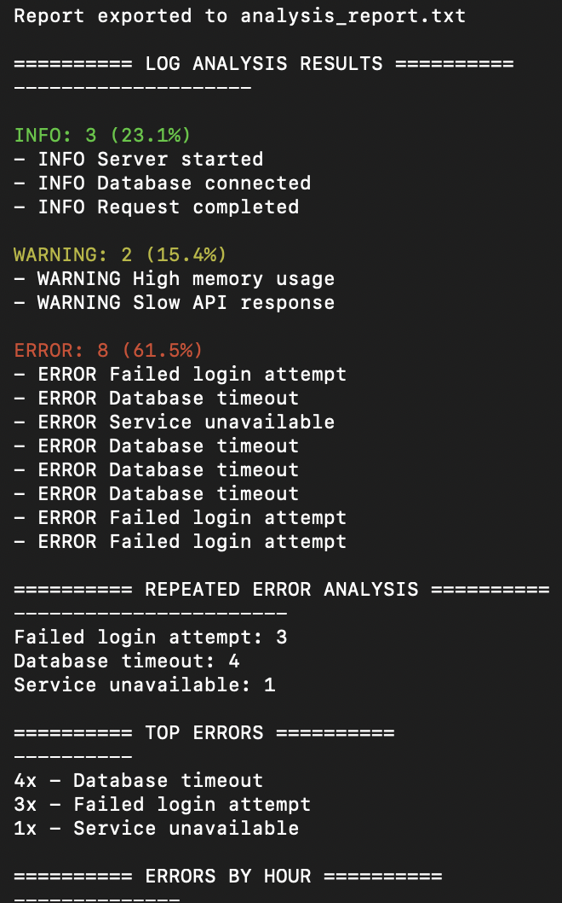
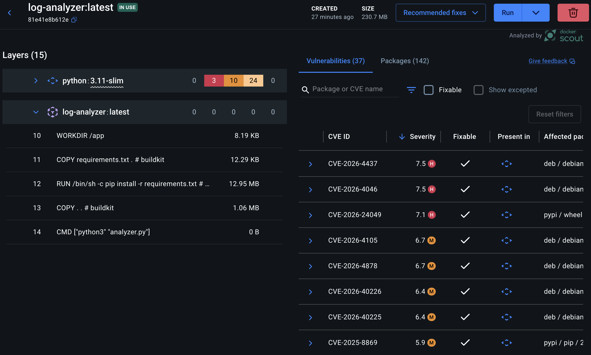

# Inventory Management System

Python-based log analysis and monitoring tool designed to parse, analyse, and report operational server logs through a modular backend architecture.

Pythonベースのログ解析・監視ツール。サーバーログの分析、エラー追跡、レポート生成を行うバックエンドプロジェクト。

Python 기반 로그 분석 및 모니터링 도구. 서버 로그 분석, 오류 추적 및 리포트 생성을 수행하는 백엔드 프로젝트.

---

## Features / 機能 / 주요 기능

- Log severity categorisation (INFO / WARNING / ERROR)
- Repeated error tracking
- Error frequency analysis
- Timestamp/hour-based error analysis
- Exportable analysis reports
- Color-coded CLI output
- Modular backend structure
- Operational monitoring workflow

---

## Tech Stack / 技術スタック / 기술 스택

- Python
- Colorama
- Git & GitHub
- Linux/ macOS terminal
- Modular Backend Architecture

---

## Docker Usage

Build container:

```bash
docker build -t log-analyzer .
```

Run Container:
```bash
docker run -it log-analyzer
```

---

## Example Output / 出力例 ||  Docker Container / Dockerコンテ

<table>
<tr>
<td width="50%" align="center">

### Example Output



</td>

<td width="50%" align="center">

### Docker Container



</td>
</tr>
</table>

---

## Project Structure / プロジェクト構成 / 프로젝트 구조

```text
log-intelligence-analyzer/

├── analyzer.py
├── parser.py
├── analytics.py
├── reporter.py
├── sample_logs/
│   └── server.log
└── analysis_report.txt
```
---

## Learning Outcomes / 学習成果 / 학습 성과

- Modular backend architecture
- Separation of concerms
- CLI application development
- Log parsing and analytics
- Report generation workflows
- Debugging and error handling

---

## Future Improvements / 今後の改善点 / 향후 개선 분야

- Docker containerization
- FastAPI dashboard
- PostgreSQL log storage
- Live log monitoring
- Slack/email alert integration
